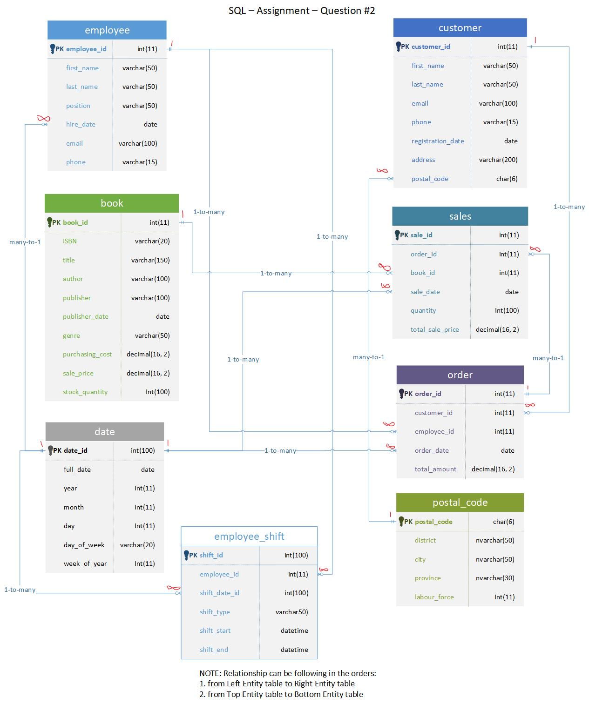

# SQL Assignment 1: Design a Logical Model
Participant Name: Si Jiao Liu

## Question 1
Create a logical model for a small bookstore. 📚

At the minimum it should have employee, order, sales, customer, and book entities (tables). Determine sensible column and table design based on what you know about these concepts. Keep it simple, but work out sensible relationships to keep tables reasonably sized. Include a date table. There are several tools online you can use, I'd recommend [_Draw.io_](https://www.drawio.com/) or [_LucidChart_](https://www.lucidchart.com/pages/).

## Question 2
We want to create employee shifts, splitting up the day into morning and evening. Add this to the ERD.

## Question 3
The store wants to keep customer addresses. Propose two architectures for the CUSTOMER_ADDRESS table, one that will retain changes, and another that will overwrite. Which is type 1, which is type 2?

_Hint, search type 1 vs type 2 slowly changing dimensions._

Bonus: Are there privacy implications to this, why or why not?

### Type 1 and Type 2 Slowly Changing Dimensions (SCD)
In data warehousing, Slowly Changing Dimensions (SCD) refer to how changes in dimensional data, such as a customer’s address, are handled. There are two common approaches: Type 1 (overwrite) and Type 2 (retain history).
- _**Type 1:**_ This method overwrites the existing value with the new value and does not retain history.
    + This approach is simpler but doesn't retain historical changes. It is best suited when historical address changes are not important.
- _**Type 2:**_ This method adds a new row for the new value and maintains the existing row for historical and reporting purposes.
    + This is more complex but useful if you need to track historical customer addresses.

### Privacy Implications
Yes, there are **privacy implications** related to retaining address history in the Type 2 approach.

- **Data Retention:** By retaining all historical addresses, the business holds more data about customers, including past locations. This can raise concerns about how long the data is stored, especially if customers do not expect their old addresses to be kept indefinitely.

- **Data Accuracy:** Over time, old addresses may no longer be valid or relevant. Retaining them in the system could lead to errors, such as sending communications/orders to outdated addresses.

- **Security:** Storing more sensitive information (like addresses) increases the risk in case of data breaches. Businesses need to ensure that proper encryption and security measures are in place.

- **Compliance:** Privacy regulations such as GDPR or CCPA may require businesses to delete or anonymize customer data upon request. In the case of Type 2 SCD, businesses must ensure they have processes to remove or mask old addresses if a customer requests it.

In contrast, Type 1 SCD, which overwrites old data, generally has fewer privacy concerns because it only retains the most recent address. However, companies should still handle this data with care to avoid unauthorized access or misuse.

## Question 4
Review the AdventureWorks Schema [here](https://imgur.com/a/u0m8fX6)

Highlight at least two differences between it and your ERD. Would you change anything in yours?

### Difference 1
The AdventureWorks OLTP schema is divided into six sections: Sales, Purchasing, Person, Production, Human Resources, and dbo, each represented by a different background color to reflect the schema's complexity. Each section has a main table containing aggregate information, supported by detailed tables for specific items listed in the main table.

In contrast, the bookstore ERD is much simpler, with fewer sections and a straightforward structure. It focuses on core entities like customers, orders, books, and sales, without the need for extensive data aggregation or detailed tables.

### Difference 2
In the AdventureWorks OLTP schema, foreign keys (FK) and unique constraints (U1, U2, U3) are explicitly identified. The foreign keys enforce referential integrity, while the unique constraints ensure data uniqueness across various columns.

In contrast, the Bookstore ERD doesn't explicitly display foreign keys or unique constraints. While adding FK relationships would improve clarity and enforce referential integrity in the ERD, the unique constraints may not be as critical due to the simpler structure of the Bookstore ERD.

# Criteria

[Assignment Rubric](./assignment_rubric.md)

# Submission Information

🚨 **Please review our [Assignment Submission Guide](https://github.com/UofT-DSI/onboarding/blob/main/onboarding_documents/submissions.md)** 🚨 for detailed instructions on how to format, branch, and submit your work. Following these guidelines is crucial for your submissions to be evaluated correctly.

### Submission Parameters:
* Submission Due Date: `September 28, 2024`
* The branch name for your repo should be: `model-design`
* What to submit for this assignment:
    * This markdown (design_a_logical_model.md) should be populated.
    * Two Entity-Relationship Diagrams (preferably in a pdf, jpeg, png format).
* What the pull request link should look like for this assignment: `https://github.com/<your_github_username>/sql/pull/<pr_id>`
    * Open a private window in your browser. Copy and paste the link to your pull request into the address bar. Make sure you can see your pull request properly. This helps the technical facilitator and learning support staff review your submission easily.

Checklist:
- [ ] Create a branch called `model-design`.
- [ ] Ensure that the repository is public.
- [ ] Review [the PR description guidelines](https://github.com/UofT-DSI/onboarding/blob/main/onboarding_documents/submissions.md#guidelines-for-pull-request-descriptions) and adhere to them.
- [ ] Verify that the link is accessible in a private browser window.

If you encounter any difficulties or have questions, please don't hesitate to reach out to our team via our Slack at `#cohort-4-help`. Our Technical Facilitators and Learning Support staff are here to help you navigate any challenges.
